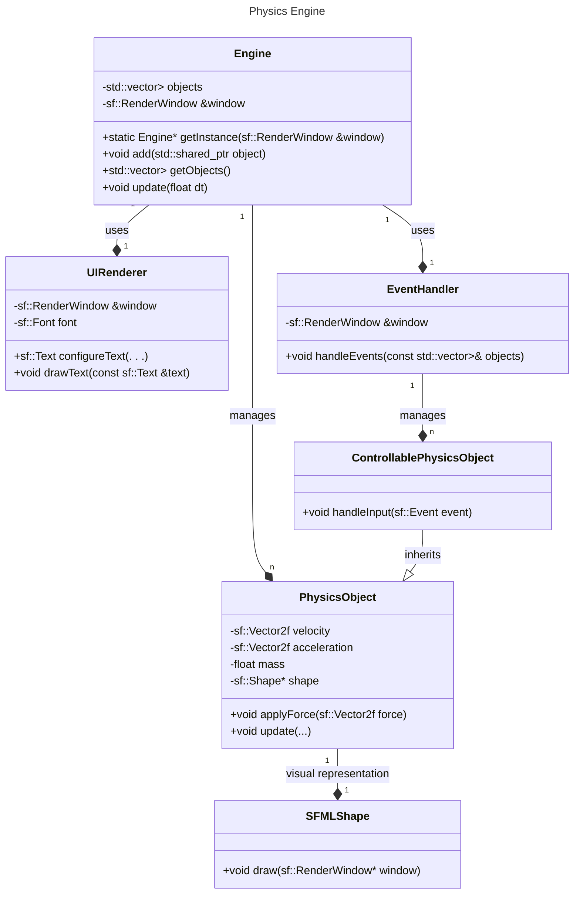

## Architecture

```mermaid
---
title: Physics Engine
---
classDiagram
    class PhysicsObject {
        -sf::Vector2f velocity
        -sf::Vector2f acceleration
        -float mass
        -sf::Shape* shape
        +void applyForce(sf::Vector2f force)
        +void update(...)
    }

    class ControllablePhysicsObject {
        +void handleInput(sf::Event event)
    }

    class SFMLShape {
        +void draw(sf::RenderWindow* window)
    }

    class UIRenderer {
        -sf::RenderWindow &window
        -sf::Font font
        +sf::Text configureText(. . .)
        +void drawText(const sf::Text &text)
    }

    class Engine {
        -std::vector<std::shared_ptr<PhysicsObject>> objects
        -sf::RenderWindow &window
        +static Engine* getInstance(sf::RenderWindow &window)
        +void add(std::shared_ptr<PhysicsObject> object)
        +std::vector<std::shared_ptr<PhysicsObject>> getObjects()
        +void update(float dt)
    }

    class EventHandler {
        -sf::RenderWindow &window
        +void handleEvents(const std::vector<std::shared_ptr<ControllablePhysicsObject>>& objects)
    }

    Engine "1" --* "n" PhysicsObject : manages
    Engine "1" --* "1" UIRenderer : uses
    Engine "1" --* "1" EventHandler : uses
    EventHandler "1" --* "n" ControllablePhysicsObject : manages
    PhysicsObject "1" --* "1" SFMLShape : visual representation
    ControllablePhysicsObject --|> PhysicsObject : inherits


```